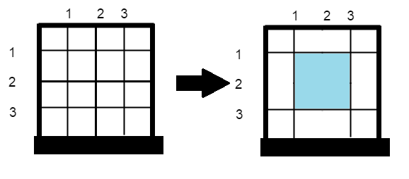

# Prison Break Challenge - Swift Solution

Programmer Sam is planning to escape from prison! The prison's gate consists of horizontal and vertical bars that are spaced one unit apart, so the area of each hole between the bars is 1 × 1. Sam manages to remove certain bars and make some of these holes bigger. Determine the area of the largest hole in the gate after the bars are removed.
 
For example, consider the diagram below. The left image depicts the initial prison gate with n = 6 horizontal and m = 6 vertical bars, where the area of the biggest hole in the bars is 1 × 1. The right image depicts that same gate after Sam removes horizontal bar 4 and vertical bar 2, at which point the area of the biggest hole in the bars becomes 2 × 2 = 4:

### Function Description 
Complete the function prison in the editor below. The function must return a long integer denoting the area of the biggest hole in the prison gate's bars.
 
prison has the following parameter(s):

*     *n*:  integer, the number of horizontal bars initially
*     *m*:  integer, the number of vertical bars initially
*     *h[h[0],...h[x-1]]*:  an array of integers, the horizontal bars to remove
*     *v[v[0],...v[y-1]]*:  an array of integers, the vertical bars to remove

### Constraints
* 1 ≤ n, m ≤ 105
* 0 ≤ x ≤ n
* 0 ≤ y ≤ m
* 1 ≤ h[i] ≤ n, where 1 ≤ i ≤ n.
* 1 ≤ v[j] ≤ m, where 1 ≤ j ≤ m.
* It is guaranteed that values in array h are distinct.
* It is guaranteed that values in array v are distinct.

### Input Format for Custom Testing

Input from stdin will be processed as follows and passed to the function.
 
The first line contains an integer n.
The second line contains an integer m.
The third line contains an integer x, the size of the array h.
Each of the next x lines contains an integer h[i] where 0 ≤ i < n.
The next line contains an integer y, the size of the array v.
Each of the next v lines contains an integer v[j] where 0 ≤ j < m.

## Sample Case 0

### Input 0
`3
3
1
2
1
2
` 
### Output 0
4
 
### Explanation 0
Bar counts are h = [2] and v = [2]. This means that Sam removes horizontal bar 2 and vertical bar 2 from the gate, so it looks like this:

## Sample Case 1

### Input 1
`2
2
0
0
` 
### Output 1
1
 
### Explanation 1
Here Sam was not able to remove any horizontal or vertical bars from the gate, so it looks like this:

The biggest hole in the area, 1, is the answer.

## Sample Case 2

### Input 2
`3
2
3
1
2
3
2
1
2
` 
### Output 2
12
 
### Explanation 2
Bar counts are h = [1, 2, 3] and v = [1, 2]. This means that Sam removes horizontal bars 1, 2, and 3, as well as vertical bars 1 and 2 from the gate, so it looks like this:

The biggest hole in the area, 12, is the answer.